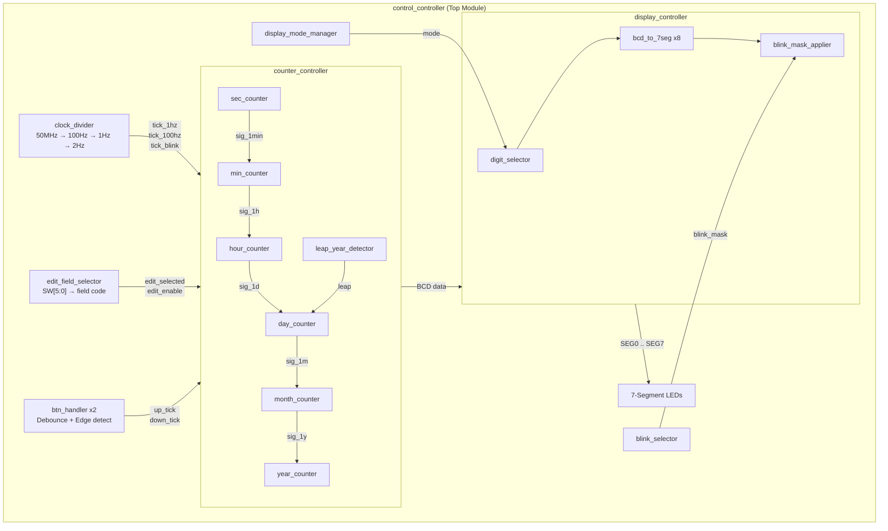

# Century Clock — FPGA Digital Clock with Date Display

A full-featured digital clock implemented in Verilog, designed for FPGA deployment with 7-segment LED display. The clock displays both **time (HH:MM:SS)** and **date (DD-MM-YYYY)**, automatically toggling between modes every minute. Users can manually edit any time/date field using physical buttons and switches.

## Features

- **Real-time clock**: Accurate timekeeping driven by a 50MHz system clock, divided down to 1Hz
- **Date tracking**: Full calendar support including day, month, and year (1–9999)
- **Leap year detection**: Correctly handles leap years using the standard Gregorian rules (divisible by 4, not by 100, unless by 400)
- **Auto mode toggle**: Display alternates between TIME and DATE every minute
- **Manual editing**: Use 6 DIP switches to select a field (sec/min/hr/day/month/year) and 2 push buttons to increment/decrement
- **Blink indicator**: The currently selected edit field blinks at 2Hz for visual feedback
- **Button debouncing**: Hardware debounce with synchronizer and edge detection for clean input signals
- **8-digit 7-segment display**: Active-low output, directly drives common-anode LED displays

## Architecture

The design follows a top-down hierarchical approach with three main blocks:



## Project Structure

```
BT_TKS/
├── control/                        # Control logic
│   ├── top_century_clock.v         # Top-level module (control_controller)
│   ├── clock_divider.v             # Clock frequency divider (50MHz → 100Hz → 1Hz → 2Hz)
│   ├── btn_handler.v               # Button debouncer with synchronizer and edge detector
│   └── edit_field_selector.v       # Switch-to-field priority encoder
│
├── counter control/                # Time/date counter chain
│   ├── top_counter.v               # Counter controller (instantiates all counters)
│   ├── sec_counter.v               # Second counter (0–59)
│   ├── min_counter.v               # Minute counter (0–59)
│   ├── hour_counter.v              # Hour counter (0–23)
│   ├── day_counter.v               # Day counter (1–28/29/30/31, month-aware)
│   ├── month_counter.v             # Month counter (1–12)
│   ├── year_counter.v              # Year counter (1–9999, Double Dabble BCD)
│   └── leap_year_detector.v        # Leap year detection logic
│
├── display/                        # Display pipeline
│   ├── top_display.v               # Display controller (instantiates display pipeline)
│   ├── digit_selector.v            # Multiplexes TIME/DATE digits based on mode
│   ├── bcd_to_7seg.v               # BCD to 7-segment decoder (active-low)
│   ├── blink_selector.v            # Generates blink mask for the edited field
│   ├── blink_mask_applier.v        # Applies blink mask to segment outputs
│   └── display_mode_manager.v      # Toggles display mode every minute
│
├── control_controller.qpf          # Quartus project file
├── control_controller.qsf          # Quartus settings file
└── .gitignore
```

## Hardware Requirements

- **FPGA Board**: Any board with a 50MHz oscillator (tested on Intel/Altera DE-series)
- **Display**: 8x common-anode 7-segment LED displays
- **Inputs**:
  - 1x active-low reset button
  - 2x push buttons (UP / DOWN)
  - 6x DIP switches (field selection)

## Pin Mapping

| Signal       | Description                          |
|:-------------|:-------------------------------------|
| `clk_50MHz`  | 50MHz system clock input             |
| `rst_n`      | Active-low reset                     |
| `BTN1`       | Increment (UP) button                |
| `BTN2`       | Decrement (DOWN) button              |
| `SW[5:0]`    | Field selection switches             |
| `SEG0..SEG7` | 7-segment display outputs (active-low) |

### Switch Mapping

| Switch | TIME Mode | DATE Mode |
|:-------|:----------|:----------|
| SW[5]  | Second    | —         |
| SW[4]  | Minute    | —         |
| SW[3]  | Hour      | —         |
| SW[2]  | —         | Year      |
| SW[1]  | —         | Month     |
| SW[0]  | —         | Day       |

## How to Use

1. **Normal mode**: The clock runs automatically. Display alternates between TIME (`HH:MM:SS`) and DATE (`DD-MM-YYYY`) every minute.
2. **Edit mode**: Flip a DIP switch to select the field you want to edit. The selected field will blink. Use BTN1 (UP) and BTN2 (DOWN) to adjust the value. The clock pauses while editing.
3. **Reset**: Press the reset button to initialize the clock to `00:00:00` on `01-01-2026`.

## Build & Program

1. Open `control_controller.qpf` in Intel Quartus Prime
2. Compile the project (Processing → Start Compilation)
3. Program the FPGA via the Programmer tool

## License

This project is for educational purposes.
