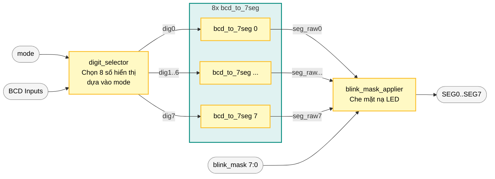

# Sơ Đồ Khối Khối Hiển Thị (Display Block)

Dưới đây là sơ đồ khối chi tiết cho khối `display` (chịu trách nhiệm hiển thị thời gian/ngày tháng lên LED 7 thanh), được tái hiện dựa trên mã nguồn Verilog trong thư mục của bạn.

## 1. Kiến trúc tổng thể Khối Hiển Thị (Display Subsystem)

Sơ đồ này mô tả sự tương tác giữa 3 module chính trong thư mục `display`: `display_mode_manager`, `blink_selector` và `display_controller`.

```mermaid
graph TD
    classDef ext_in fill:#fce4ec,stroke:#d81b60,stroke-width:2px,color:#000;
    classDef ext_out fill:#e8f5e9,stroke:#2e7d32,stroke-width:2px,color:#000;
    classDef module fill:#e3f2fd,stroke:#1e88e5,stroke-width:2px,color:#000;
    classDef sub_module fill:#bbdefb,stroke:#1565c0,stroke-width:1px,color:#000;

    %% Đầu vào bên ngoài
    tick_1min([tick_1min]):::ext_in
    tick_blink([tick_blink]):::ext_in
    edit_sel([edit_selected 2:0]):::ext_in
    bcd_in([Dữ liệu BCD từ Counters<br>sec, min, hr, day, mon, yr]):::ext_in

    %% Các Module chính
    dmm[display_mode_manager]:::module
    bs[blink_selector]:::module
    
    subgraph display_controller [display_controller.v]
        style display_controller fill:#fff,stroke:#666,stroke-width:2px,stroke-dasharray: 5 5
        ds[digit_selector]:::sub_module
        bcd2seg[bcd_to_7seg x8]:::sub_module
        bma[blink_mask_applier]:::sub_module
    end

    %% Đầu ra
    led_out([8x LED 7 Đoạn<br>SEG0 - SEG7]):::ext_out

    %% Luồng dữ liệu và điều khiển
    tick_1min -->|Chuyển mode mỗi phút| dmm
    dmm -->|mode (0:TIME, 1:DATE)| bs
    dmm -->|mode| ds
    
    tick_blink --> bs
    edit_sel -->|Trường đang chỉnh| bs
    bs -->|blink_mask 7:0| bma
    
    bcd_in -->|Các giá trị BCD| ds
    ds -->|dig0..dig7 (đã chọn theo mode)| bcd2seg
    bcd2seg -->|seg_raw0..7| bma
    bma -->|Áp dụng nhấp nháy| led_out
```

## 2. Chi tiết bên trong `display_controller.v`

Sơ đồ này đi sâu vào cách `display_controller` xử lý luồng dữ liệu thông qua các module con.


